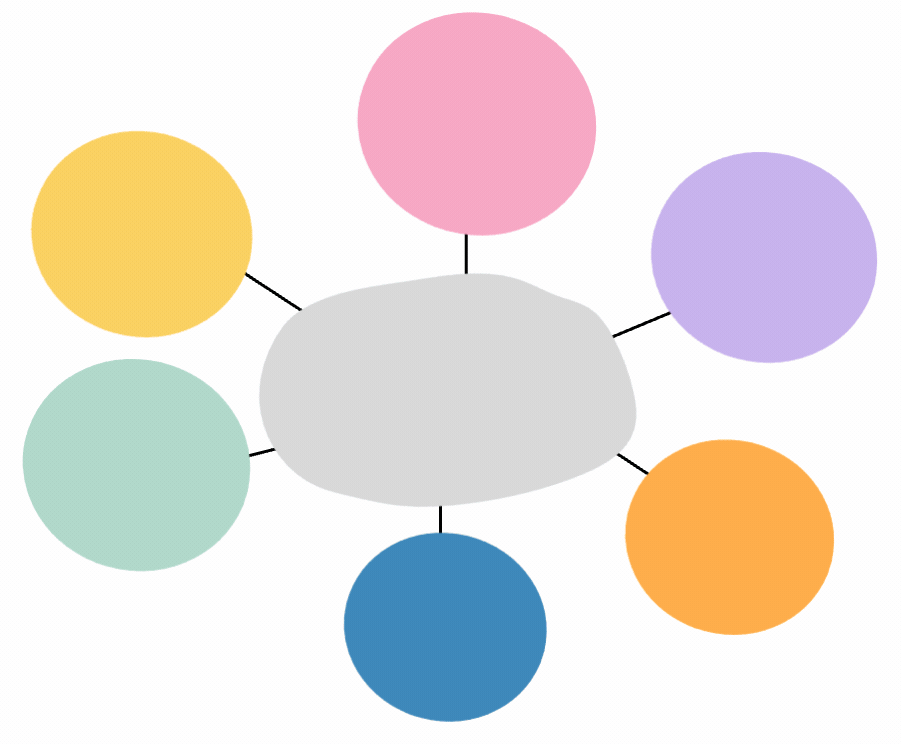

# Hi there, I'm Salohiddin Urokov 👋

> A Deep Learning researcher/engineer, who builds awesome AI/Computer Vision applications. A loving father to a lovely cute little daughter 👨‍🍼.
  

<h1> 👨🏻‍💻 Me now </h1>

- 🤔 &nbsp; Exploring new technologies and developing Deep Learning modules related to Computer Vision tasks.
- 🎓 &nbsp; Computer and AI Engineering - Currently doing PhD at Kumoh National Institute of Technology (KIT).
- ⌛️ &nbsp; Currently I'm busy with:
- 💼 &nbsp; Doing research in [CVPR](http://cvpr.kumoh.ac.kr) lab of Kumoh National Institute of Technology (KIT).
- 🌱 &nbsp; Learning AI/Deep Learning, Computer Vision and a lot more AI related stuff.
- 📫 &nbsp; Reach me at: surokovai@gmail.com

### 📚 Skills

  
   
   
  
  
  
  
  
   
  
  

<!--
 

 
-->
<h1>My Stats</h1>

<a href="">
  
<a />

  

<!--
**salohiddin22/salohiddin22** is a ✨ _special_ ✨ repository because its `README.md` (this file) appears on your GitHub profile.

Here are some ideas to get you started:

- 🔭 I’m currently working on ...
- 🌱 I’m currently learning ...
- 👯 I’m looking to collaborate on ...
- 🤔 I’m looking for help with ...
- 💬 Ask me about ...
- 📫 How to reach me: ...
- 😄 Pronouns: ...
- ⚡ Fun fact: ...
-->
