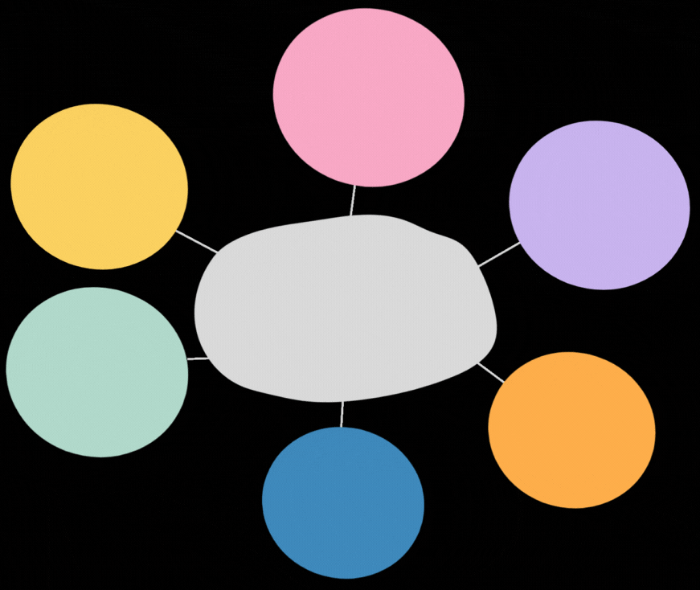

# Hi there, I'm Salohiddin 👋

> **Senior AI Engineer** building real-time Computer Vision and Multimodal AI systems for industrial environments.

 

## 👨🏻‍💻 About Me

- 🏭 &nbsp; Senior ML & DL Engineer — building production AI vision systems for industrial safety, defect inspection, and surveillance analytics
- 🎓 &nbsp; Ph.D. candidate in Computer-AI Convergence Engineering at Kumoh National Institute of Technology (KIT)
- 🔬 &nbsp; Research background at the CVPR Lab (KIT) — segmentation, attention-based classification, synthetic data generation
- ⚡ &nbsp; I work across the full lifecycle: data collection → annotation → training → optimization → edge deployment
- 🌱 &nbsp; Currently going deeper into Vision-Language Models and applying vision to physical systems (robotics / autonomous platforms)

> ℹ️ &nbsp; Most of my recent work lives in private company repositories, so this profile reflects my stack rather than my public codebase.

## 🎯 Focus Areas

**Computer Vision** &nbsp;·&nbsp; Object Detection · Segmentation · Pose Estimation · Action Recognition · Anomaly Detection · Tracking · Image Classification

**Multimodal AI** &nbsp;·&nbsp; Vision-Language Models (VLM) · Visual Grounding · VLM Fine-tuning

**Edge AI** &nbsp;·&nbsp; Model Lightweighting · Quantization · Pruning · Real-time Inference Optimization

## 🔧 Tech Stack

**Languages**

**Deep Learning & Vision**

**Edge AI & Optimization**

**Data & Tooling**

## 🌐 Languages

English (IELTS 8.0) &nbsp;·&nbsp; Korean (TOPIK 5) &nbsp;·&nbsp; Russian &nbsp;·&nbsp; Uzbek (Native)

---

<i>Open to opportunities in Computer Vision, Multimodal AI, and Edge AI.</i>

